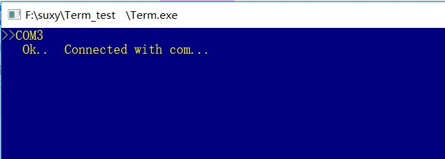

+ Write `flashram.bit` to FPGA:

+ Write `kernel.bin` to ram2 (instructions) :

+ Write `ram1.data` to ram1:

+ Wrtie `CPU.bit` to FPGA:

+ Default VGA output:

+ Connect COM by `Term.exe`

+ Load ram1.data to VGA:

+ VGA output from ram1.data:

+ Load an image to VGA by instructions:

+ Load another image to VGA by instructions:

+ Test `Fibonacci`:

+ Test `Performance Test 1`: (125/3.5313=35.4M)

+ Test `Performance Test 2`: (200/5.0243=39.8M)

+ Test `Performance Test 3`: (100/3.0177=33.1M)

+ Test `Performance Test 4`: (125/4.5177=27.7M)

+ Test `Performance Test 5`: (75/3.0233=24.8M)

